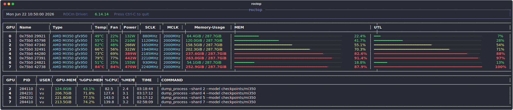

# roctop

`roctop` is a small AMD ROCm GPU monitor. It shows GPU VRAM usage,
utilization, type, temperature, power, clocks, and GPU processes in a
refreshing terminal UI.

## Demo



## Install

```bash
python3 -m venv --system-site-packages .venv
.venv/bin/python -m pip install -e .
export PATH="$PWD/.venv/bin:$PATH"
```

## Usage

```bash
roctop
roctop --interval 0.5
roctop --once
roctop --json
```

Press `Ctrl-C` to quit the live view.
